# UE5 Zombie Japan

Third-person action prototype built in **Unreal Engine 5.4** with melee and ranged combat, stealth takedowns, equipment management, and AI-driven enemies in a Japanese-inspired environment.

> Portfolio showcase repo with screenshots, demo video, feature notes, and architecture documentation for portfolio and public viewing.

## Gameplay demo

<video src="media/video/demo.mp4" controls width="100%"></video>

*Full reel: [media/video/demo.mp4](media/video/demo.mp4)*

**Portfolio page:** [aidanohalloran.com/projects/unreal-game](https://aidanohalloran.com/projects/unreal-game)

## Quick links

| Resource | Location |
|----------|----------|
| Portfolio site | [aidanohalloran.com/projects/unreal-game](https://aidanohalloran.com/projects/unreal-game) |
| Feature list | [docs/FEATURES.md](docs/FEATURES.md) |
| Architecture notes | [docs/ARCHITECTURE.md](docs/ARCHITECTURE.md) |
| Gameplay screenshots | [media/screenshots/gameplay/](media/screenshots/gameplay/) |
| Editor screenshots | [media/screenshots/editor/](media/screenshots/editor/) |
| Demo video | [media/video/demo.mp4](media/video/demo.mp4) |

## Highlights

- **Camera** — button toggle between third-person and first-person (`IA_PerspectiveChange`)
- **Combat** — sword melee with animation notifies, dodge roll, hit reactions, and camera shake feedback
- **Ranged weapons** — pistol, AK, sniper (with scope UI), bow, and throwable objects
- **Stealth** — paired assassination animations with on-screen prompt UI
- **Equipment** — slot-based weapon system with data tables and in-game equipment menu
- **AI** — behavior trees for patrol, chase, investigate, and attack; separate boss AI controller
- **World** — Japanese shrine Megascans assets, landscape tooling, Ultra Dynamic Sky

## Tech stack

| | |
|---|---|
| Engine | Unreal Engine 5.4 |
| Language | Blueprints (visual scripting) |
| Input | Enhanced Input (`IMC_Default`) |
| AI | Behavior Trees, Blackboards, EQS-style patrol tasks |
| Rendering | DX12 / SM6, Virtual Shadow Maps, Virtual Textures |
| Plugins | Motion Warping, Landmass, Landscape Patch, Modeling Tools |

## Controls (default)

| Action | Input |
|--------|-------|
| Move / Look | WASD + Mouse |
| Sprint | Shift |
| Crouch | Ctrl |
| Dodge | X |
| Interact | G |
| Inventory / Equipment | E |
| Toggle 1st / 3rd person | M |
| Camera lock | L |
| Attack | LMB |
| Jump | Space |

## Screenshots

### Gameplay

| | |
|---|---|
| Third-person snow map, HUD, AI chase | Sniper scope aiming |
|  | 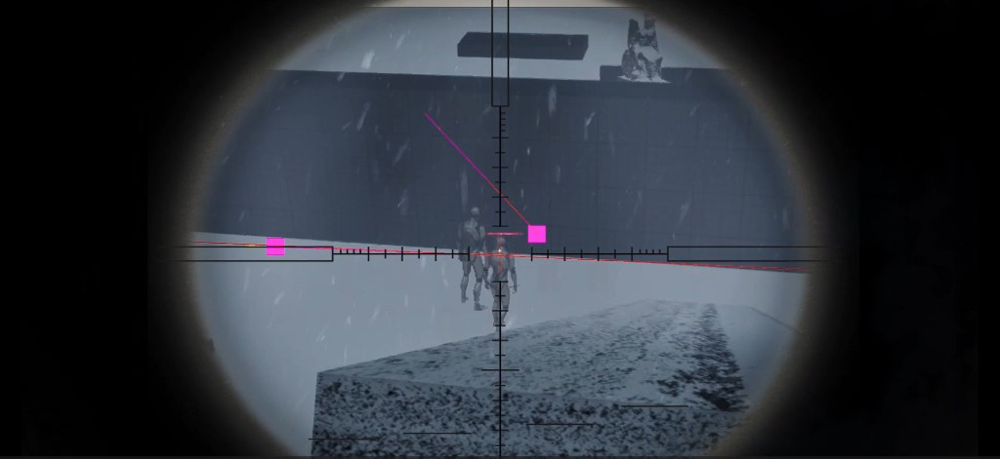 |
| Equipment menu | Melee combat with hit detection |
| 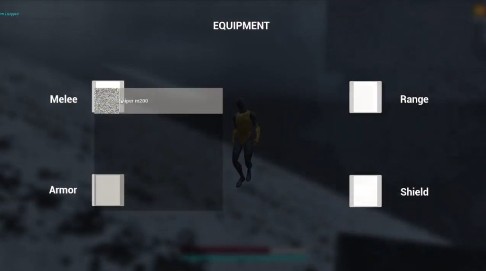 | 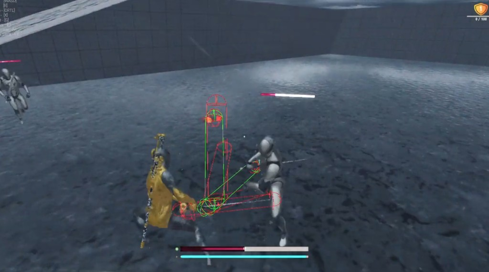 |

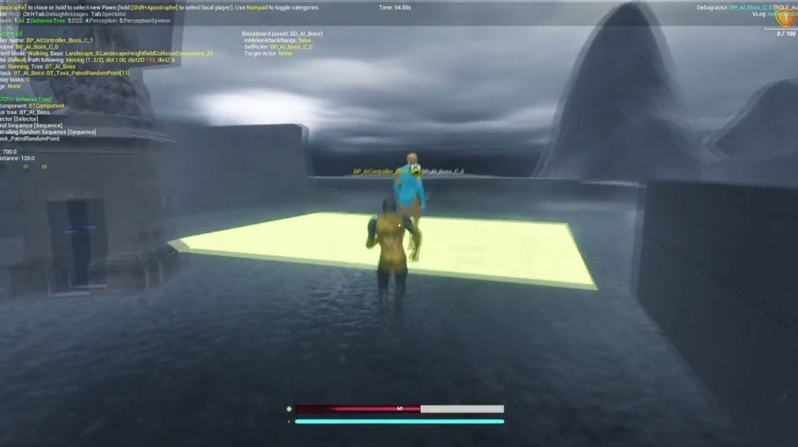

*More: [media/screenshots/gameplay/](media/screenshots/gameplay/)*

### Editor & Blueprints

| | |
|---|---|
| `BP_AI_Boss` — sword socket, widgets, collision | `BT_AI_Boss` — chase, attack, patrol logic |
| 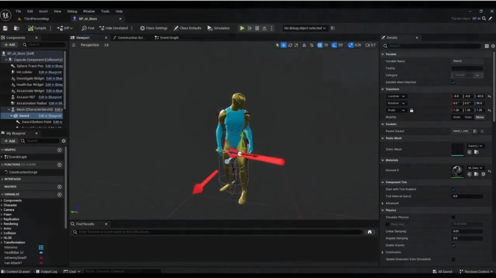 | 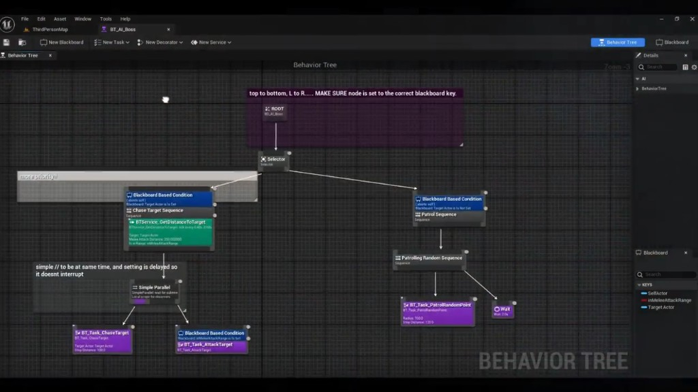 |
| Assassination radius + ragdoll (`BP_Dummy`) | `BP_ThirdPersonCharacter` event graph |
| 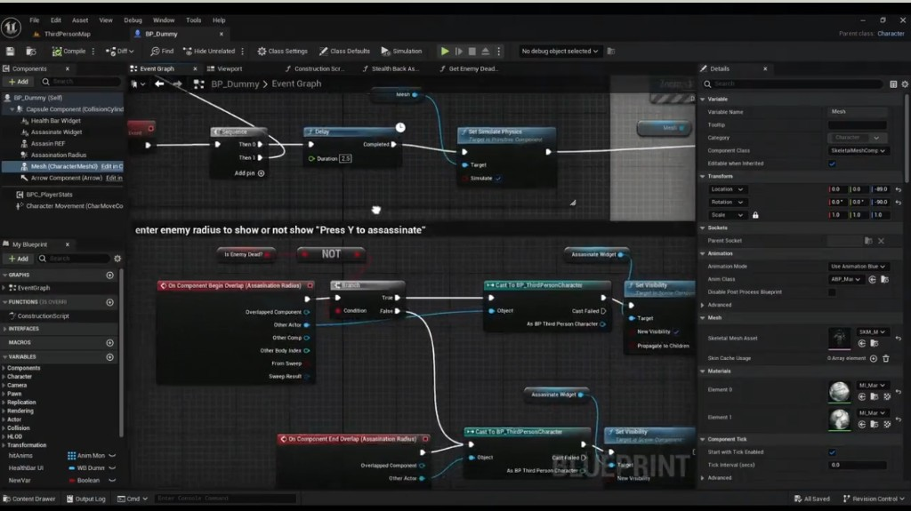 | 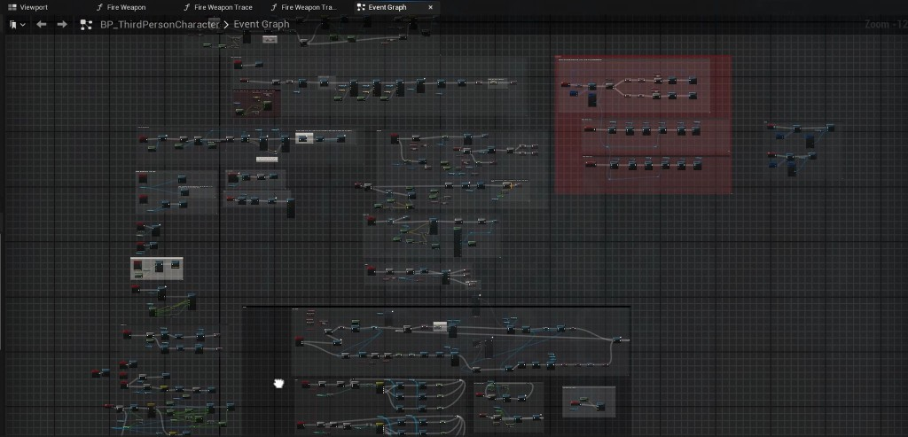 |

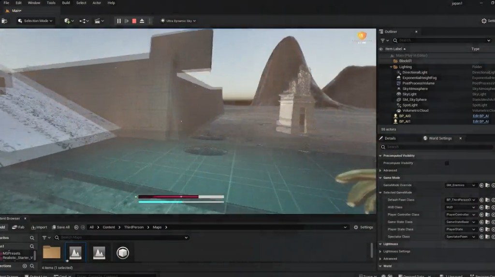

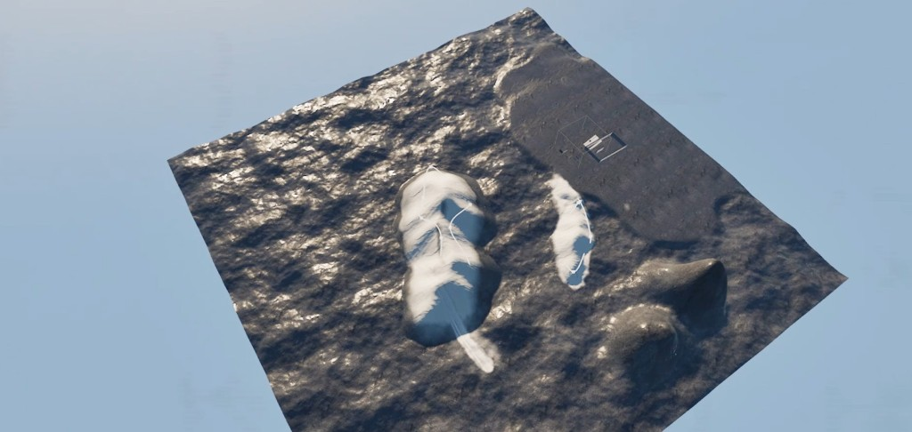

*More: [media/screenshots/editor/](media/screenshots/editor/)*

### Earlier captures

| | |
|---|---|
| UE 5.4.3 project loading | First-person snow gameplay |
| 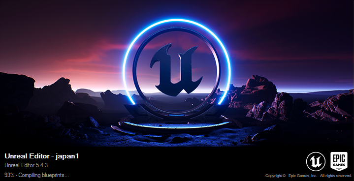 | 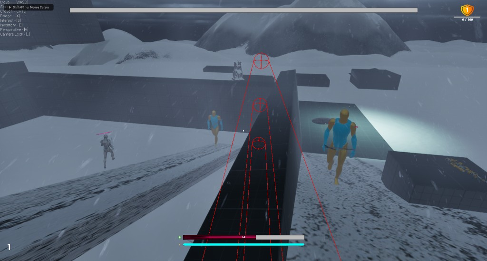 |

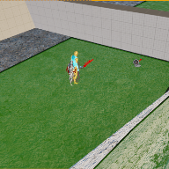

## Project structure (source)

Local Unreal project path:

```
C:\Users\aohal\OneDrive\Documents\Unreal Projects\japan1
```

Key content folders:

```
Content/
├── ThirdPerson/          # Player character, input, maps (Main, ThirdPersonMap)
├── Blueprints/           # Attack system, player stats, enemy spawner, anim notifies
├── Equipment_System/     # Weapons, slots, equipment UI
├── AI/                   # Regular + boss behavior trees and controllers
├── Characters/RPG_Character/  # Locomotion, combat, stealth animations
├── 3dAssets/Weapons/     # Sword, bow, pistol, AK, sniper, shield
├── UI/                   # HUD, boss bar, sniper scope, prompts
├── Audio/                # Footsteps, gunshots, sword hits, grunts
├── FXs/                  # Combat and environment VFX
└── Megascans/            # Japanese environment surfaces and props
```

## Portfolio usage

This repo is designed to link from a portfolio site. Suggested embed pattern:

- **Hero** — best environment or combat screenshot
- **Video** — embed `media/video/demo.mp4` or link to [aidanohalloran.com/projects/unreal-game](https://aidanohalloran.com/projects/unreal-game)
- **Details** — link to [FEATURES.md](docs/FEATURES.md) and [ARCHITECTURE.md](docs/ARCHITECTURE.md)
- **Tech tags** — `Unreal Engine 5`, `Blueprints`, `Behavior Trees`, `Enhanced Input`, `Motion Warping`

## Local development

1. Open `japan1.uproject` in Unreal Engine 5.4
2. Default map: `Content/ThirdPerson/Maps/ThirdPersonMap`
3. Play-in-editor to test combat, AI, and equipment flows

> **Note:** The full `.uasset` project is not committed here (binary size + marketplace assets). This repository is documentation and media only.

## Author

**Aidan O'Halloran** — [GitHub](https://github.com/aohallx)

## License

Portfolio showcase only. Game assets may include third-party marketplace content (Megascans, Paragon, Fab, etc.). Not licensed for redistribution.
