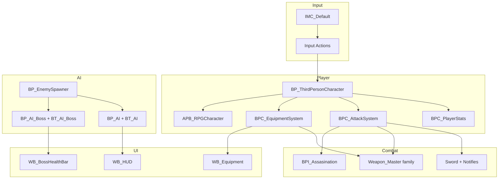

# Architecture Notes — UE5 Zombie Japan

High-level system design for the `japan1` Blueprint project. Intended for portfolio readers and future you.

## Overview

The project extends the UE5 Third Person Blueprint template into a combat-focused action prototype. Gameplay is composed in Blueprints with a component-driven player and data-driven equipment. Enemy logic is split between reusable AI tasks/services and separate regular vs. boss behavior trees.



## Core modules

### 1. Player (`Content/ThirdPerson/`)

| Asset | Role |
|-------|------|
| `BP_ThirdPersonCharacter` | Player pawn; wires input, components, and animation |
| `BP_ThirdPersonGameMode` | Default game mode and spawn rules |
| `GM_Enemies` | Variant tuned for enemy-focused playtests |
| `IMC_Default` | Enhanced Input context |
| `IA_*` actions | Discrete gameplay actions (move, attack, dodge, equip, etc.) |

**Design choice:** Enhanced Input keeps bindings modular and makes rebinding / platform porting easier than legacy axis/action mappings.

### 2. Combat components (`Content/Blueprints/`)

| Asset | Role |
|-------|------|
| `BPC_AttackSystem` | Central combat state: attacks, traces, damage routing |
| `BPC_PlayerStats` | Health, stamina, or other player attributes |
| `BP_Notify_SwordTraceLoop` | Anim notify — repeated weapon sweep during swing |
| `BP_Notify_SphereTrace` | Anim notify — spherical hit detection window |
| `BPI_Assasination` | Interface for stealth kill eligibility |
| `BPI_SetEnemyDead` | Interface to propagate death to AI / UI |

**Melee flow**

1. Input triggers attack montage on `APB_RPGCharacter`
2. Notifies enable/disable weapon traces
3. `BPC_AttackSystem` resolves hits and applies damage
4. Camera shake + audio + hit react on success

**Stealth flow**

1. `BPI_Assasination` checks victim state and position
2. Prompt UI (`WB_AssasinatePrompt`) shown when valid
3. Paired montages play on attacker and victim
4. `BPI_SetEnemyDead` updates AI and HUD

### 3. Equipment system (`Content/Equipment_System/`)

| Asset | Role |
|-------|------|
| `BPC_EquipmentSystem` | Runtime equip/unequip, slot management |
| `DB_Weapons` | Data table driving weapon stats and references |
| `S_Weapons`, `S_Slots` | Struct definitions for items and slots |
| `E_Weapon_Types`, `E_Melee_Weapons` | Type enums for categorization |
| `Weapon_Master` / `BP_Weapon` | Base weapon actor hierarchy |
| `WB_Equipment` | Player-facing equipment UI |

**Design choice:** Data tables separate design tuning from Blueprint logic. New weapons can be added by extending `Weapon_Master` and registering a row in `DB_Weapons`.

### 4. Weapons (`Content/3dAssets/Weapons/`)

Weapon implementations inherit from shared Blueprint parents:

- **Melee:** `sword/`
- **Ranged:** `pistol_cyber`, `ak_8bit`, `Sniper_m200`
- **Special:** `Bow1_Wood`, `Shield1`
- **Projectiles:** `BPC_Bullet`, `Bullet_Sniper`

Ranged weapons integrate with sniper UI, equip montages, and `E_FireType` for fire-mode variation.

### 5. AI (`Content/AI/`)

Two parallel stacks share tasks/services but use different trees and controllers.

#### Regular enemies

```
BP_EnemySpawner
    └── BP_AI (pawn)
            └── BP_AIController_Generic
                    ├── BD_AI (blackboard)
                    └── BT_AI (behavior tree)
                            ├── BT_Task_PatrolRandomPoint
                            ├── BT_Task_ChaseTarget
                            ├── BT_Task_AttackTarget
                            ├── BT_Task_ClearInvestigateValue
                            └── BTService_GetDistanceToTarget
```

**Typical state flow:** Patrol → sense player → chase → attack → investigate / reset.

#### Boss

```
BP_AI_Boss
    └── BP_AIController_Boss
            ├── BD_AI_Boss
            └── BT_AI_Boss
```

Boss uses dedicated UI (`WB_BossHealthBar`) and likely extended attack phases (tune in-editor).

**Sight config:** `DefaultGame.ini` sets `bAutoRegisterAllPawnsAsSources=false` on `AISense_Sight` for controlled perception setup.

### 6. Animation (`Content/Characters/RPG_Character/Animations/`)

Organized by gameplay concern:

| Folder | Purpose |
|--------|---------|
| `Locomotion/` | Walk, idle, stop blend spaces |
| `SwordAttacks/` | Melee combos |
| `Range_Aiming/` | ADS, sniper, rifle equip |
| `Assasinations/` | Paired stealth kills |
| `Dodge_Roll/` | Evasion |
| `Vaulting/` | Traversal |
| `Crouched/` | Stealth movement |
| `Hit_Reacts/` | Damage response |
| `Interactions/` | Throwables |

`APB_RPGCharacter` is the hub graph blending locomotion, combat layers, and montages.

### 7. Camera (`BP_ThirdPersonCharacter` + input)

| Asset | Role |
|-------|------|
| `IA_PerspectiveChange` | Input action — toggles between first- and third-person |
| Follow camera (3rd person) | Default exploration and combat view |
| First-person camera | Alternate view for aiming, immersion, or tight spaces |

**Toggle flow**

1. Player presses the perspective-change binding
2. `BP_ThirdPersonCharacter` swaps active camera (spring arm / FOV / attach socket)
3. Combat, aim, and HUD systems continue on the same pawn

Useful for portfolio demos: show the same combat sequence in both views.

### 8. UI (`Content/UI/`)

| Widget | Purpose |
|--------|---------|
| `WB_HUD` | Root in-game HUD |
| `WB_BossHealthBar` | Boss encounter feedback |
| `WB_DummyHealth` | Training dummy / generic target HP |
| `WB_SniperScope` | Ranged aiming overlay |
| `WB_AssasinatePrompt` | Stealth action prompt |
| `WB_InvestigateIcon` | AI investigation indicator |

### 9. World building

- **Maps:** `Main.umap` (primary), `ThirdPersonMap.umap` (prototype)
- **Environment art:** Megascans Japanese assets, Fab imports, `UltraDynamicSky`
- **Landscape:** Landmass + Landscape Patch plugins for terrain workflows
- **World Partition:** External actor/object folders under `Content/__ExternalActors__`

### 10. Rendering & platform (`Config/DefaultEngine.ini`)

- DX12 default RHI, SM6 shader target
- Virtual Shadow Maps enabled
- Virtual Textures enabled
- Lumen / DGI settings present (project uses mixed lighting configuration)

## Data flow summary

```
Input Action
  → Character Blueprint
    → Component (Attack / Equipment / Stats)
      → Animation Montage + Notifies
        → Trace / Projectile / Interface call
          → Enemy AI or Boss (Blackboard update)
            → UI + Audio + VFX feedback
```

## Extension points

| Want to add… | Start here |
|--------------|------------|
| New weapon | `Weapon_Master`, `DB_Weapons`, equip montages |
| New enemy type | Duplicate `BP_AI`, adjust mesh/anim, reuse `BT_AI` |
| New boss phase | `BT_AI_Boss`, `BD_AI_Boss`, boss montages |
| New input action | `ThirdPerson/Input/Actions/`, add to `IMC_Default` |
| New UI panel | `Content/UI/`, hook from `WB_HUD` |

## What is not in this repo

- Compiled `.uasset` binaries (stay in local Unreal project)
- `DerivedDataCache/`, `Intermediate/`, `Saved/` (gitignored in source project)
- Marketplace / Megascans license files
- Editor security tokens or machine-specific config

## Related files

- [FEATURES.md](FEATURES.md) — checklist of implemented systems
- [../README.md](../README.md) — portfolio entry point
